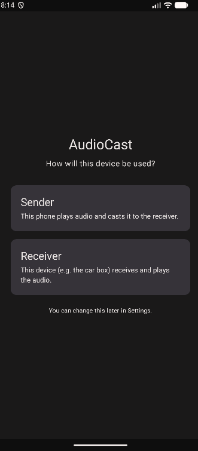
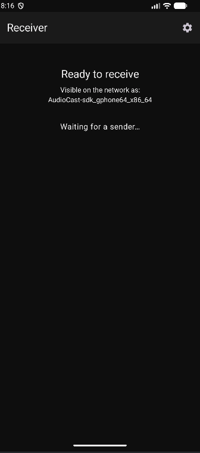
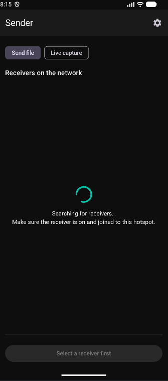

# AudioCast

Cast audio from an Android phone to an Android TV box (or any Android device) over
your local network — including a phone hotspot. Built for playing phone audio
through a car's Android head unit without fighting Bluetooth.

One app runs as either **Sender** (the phone) or **Receiver** (the box); you pick
the role on first launch and can change it in Settings.

## Screenshots

<p>
  
  
  
</p>

## Modes

- **Live capture** — streams whatever the phone is playing (any app: a music
  player, YouTube, a browser) as raw PCM, using Android's playback-capture API.
- **File cast** — sends a local audio file (mp3/flac/m4a/…) as-is to the
  receiver, which decodes and plays it. No re-encoding.

## Features

- Automatic receiver discovery on the LAN via NSD — no typing IP addresses.
- Bounded jitter buffer on the receiver: latency stays small and constant
  instead of drifting upward over time.
- Receiver runs as a foreground service, so it keeps playing when it isn't the
  focused app and works alongside a TV box's autostart.
- Capture auto-pauses during phone calls and resumes afterward.

## Requirements

- Android 10 (API 29) or newer on **both** devices.
- Both devices on the same network (e.g. the phone's hotspot).

## Build

Open in Android Studio and run, or from the command line:

```
./gradlew assembleDebug
```

Toolchain: Android Gradle Plugin 8.5.2, Gradle 8.11.1, Kotlin 2.0.20, JDK 17–21,
compileSdk 34, minSdk 29.

## Usage

1. Install on both devices.
2. On the box choose **Receiver**; on the phone choose **Sender**.
3. Put both on the same hotspot/network.
4. On the phone, tap the discovered receiver, then either **Choose file & cast**
   or switch to **Live capture** and **Start casting** (grant the microphone and
   screen-capture prompts the first time).

For live capture, turn the phone's own media volume down so you only hear the
receiver.

## Notes

A personal project that does its one job. Not affiliated with any product.
